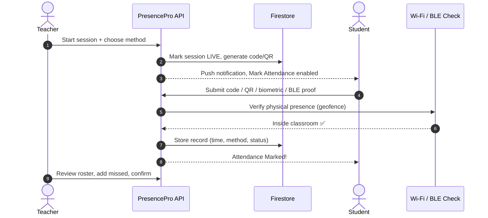
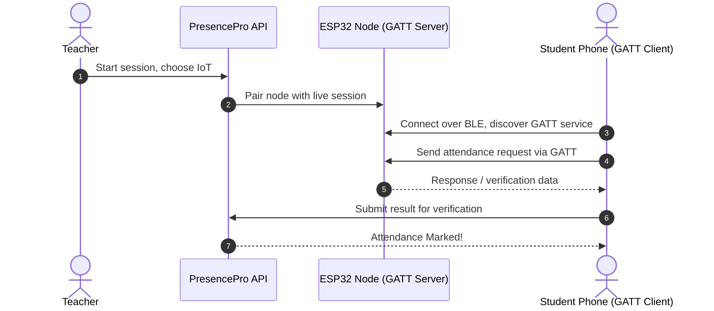
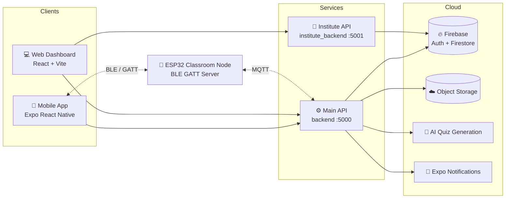

<div align="center">


### Smart Attendance & Curriculum Management, in one app.

**Proxy-proof attendance. Zero paperwork. One connected campus.**


</div>

---

## 💡 Why PresencePro?

Most campuses still run on paper registers, spreadsheets, WhatsApp groups, and Google Forms. The result is familiar to every student and teacher:

| The old way 😩 | The PresencePro way ✨ |
| --- | --- |
| Roll calls eat into lecture time | Attendance is marked in **seconds** |
| Friends answer "present" for each other | **Wi-Fi + BLE presence checks** make proxies very hard |
| Assignments scattered across chats and email | Tasks, submissions, and deadlines live in **one place** |
| Announcements get lost in group noise | **Targeted** messages to a class, a group, or low-attendance students |
| Reports compiled by hand | **One-tap PDF reports** with filters |
| Students find out they're short on attendance too late | A **live dashboard** shows attendance, tasks, and quizzes |

PresencePro brings attendance, assignments, quizzes, announcements, and reporting into a single ecosystem that teachers, students, and institutions can all rely on.

---

## ✨ Features

### 🎯 Flexible, secure attendance
Teachers start a session during a scheduled lecture and pick **one** verification method:

| Method | How it works |
| --- | --- |
| 📡 **IoT (BLE + GATT)** | An ESP32 classroom node exposes a **GATT** service over BLE. The student's phone connects to it at very short range to mark attendance, and the node is paired with the teacher's live session |
| 🔢 **Code-based** | A short-lived session code is generated; students pick the correct code from on-screen options before it expires |
| 📷 **Time-based QR** | A rotating QR code prevents screenshots from being shared |
| 👆 **Biometric + geofencing** | Verifies identity and location together |

Every session also enforces **geofencing** using a combination of Wi-Fi fingerprinting and BLE beacons, so only students physically in the room can mark attendance.

After the session, teachers can **review the roster, add missed students, apply manual overrides, or stop the session**, all from the app.

### 🧑‍🏫 Teacher tools
- **Live dashboard** with the ongoing lecture timer, upcoming lectures, and quick actions
- **Live attendance roster** that updates as students check in
- **Assignments** with deadlines, submission counts, and optional feedback
- **Quizzes**: create them manually, or **generate them with AI** from a syllabus
- **Announcements** to the whole class, specific students, groups, or students below an attendance threshold (e.g. under 75%)
- **Reports** filtered by subject, attendance percentage, and time period, exportable to **PDF**
- **On-duty (OD) requests** for sessions missed for approved reasons

### 🎓 Student experience
- **Personal dashboard** with current session progress, overall attendance %, and absence count
- **Subject-wise attendance tracker** with a daily and overall view
- **Tasks & submissions** grouped as Assigned, Missing, and Done
- **Quizzes** with upcoming and previous attempts and scores
- **Announcements feed** filterable by Class, Individual, and Group
- **Push notifications** for deadlines and updates

### 🏛️ Institute administration
- Manage **colleges, courses, subjects, users, and classes**
- Role-based access for **students, teachers, head teachers, and institute admins**
- Institute management screens on the web dashboard

---

## 🔐 How Attendance Works



### 📡 IoT attendance with ESP32 and GATT

The IoT method is built around an **ESP32** classroom node that communicates over **BLE using GATT (Generic Attribute Profile)**.

- **Why GATT?** The ESP32 in this setup speaks only BLE, and GATT gives it a standard way to exchange data with phones. The ESP32 acts as the **GATT server**, exposing a service that the student's phone connects to as a **GATT client**, so phones that can't talk to the board directly still work with it.
- **Paired with the teacher's session:** when the teacher picks IoT-based marking, the ESP32 node is paired with that live session, so only check-ins for the current lecture are accepted.
- **Very short range:** the BLE connection only works in the classroom, which ties attendance to physical presence.
- **Plus geofencing:** the Wi-Fi + BLE geofence still applies on top of the GATT handshake.



**Attendance is blocked before the teacher starts the session.** The button stays disabled and an error is shown if a student tries early. Each record stores **who, which subject, when, by which method, and with what status** (`present`, `absent`, `late`, `manual`).

---

## 🏗️ Architecture



### Repository layout

```text
backend/             Main application API (default port 5000)
institute_backend/   Institute administration API (default port 5001)
mobile-app/          Expo React Native application
presencepro-web/     Vite React web dashboard
```

The main backend mounts route groups such as `/auth`, `/api/lectures`, `/api/quizzes`, `/api/assignments`, `/api/reports`, `/api/broadcasts`, `/api/manage`, and `/api/od`. The institute backend automatically mounts route files from its `routes/` directory and listens on port 5001 by default.

### Tech stack

| Layer | Technology |
| --- | --- |
| Mobile | React Native (Expo), single codebase for Android and iOS |
| Web | React, Vite |
| APIs | Node.js, Express |
| Auth & data | Firebase Authentication, Cloud Firestore |
| Files | S3-compatible object storage (R2) |
| AI | Groq-powered quiz generation |
| Devices | ESP32 nodes, BLE with GATT (server on ESP32, client on phone), MQTT |
| Notifications | Firebase Cloud Messaging (FCM) |

---

## 🚀 Getting Started

### Prerequisites

- Node.js 18 or newer
- npm
- Firebase projects with Authentication and Firestore enabled
- Expo CLI workflow for mobile development
- Android Studio and an Android SDK for native Android builds

### 1. Install dependencies

```bash
cd backend && npm install
cd ../institute_backend && npm install
cd ../mobile-app && npm install
cd ../presencepro-web && npm install
```

### 2. Configure environment

Environment files and Firebase service-account JSON files are intentionally ignored by Git. **Never commit credentials.**

<details>
<summary><b>⚙️ Backend environment</b></summary>

Common variables used by the main backend:

```text
PORT=5000
GROQ_API_KEY=...
R2_ENDPOINT=...
WEB_APP_URL=http://localhost:5173
```

The institute backend uses at least:

```text
PORT=5001
JWT_SECRET=...
```

Place the required Firebase Admin credentials in the local backend configuration expected by the service. Use a secret manager or deployment environment variables in production.
</details>

<details>
<summary><b>💻 Web environment</b></summary>

Create `presencepro-web/.env`:

```text
VITE_API_URL=http://localhost:5000
VITE_INSTITUTE_API_URL=http://localhost:5001
```
</details>

<details>
<summary><b>📱 Mobile environment</b></summary>

Create `mobile-app/.env` with the Expo public Firebase variables used by `src/services/firebase.ts`:

```text
EXPO_PUBLIC_API_URL=http://<your-development-machine-ip>:5000
EXPO_PUBLIC_FB_API_KEY=...
EXPO_PUBLIC_FB_AUTH_DOMAIN=...
EXPO_PUBLIC_FB_PROJECT_ID=...
EXPO_PUBLIC_FB_STORAGE_BUCKET=...
EXPO_PUBLIC_FB_MESSAGING_SENDER_ID=...
EXPO_PUBLIC_FB_APP_ID=...
```

For a physical device, use the development machine's LAN IP instead of `localhost`. Some legacy mobile screens currently contain their own local API fallback; update those values or centralize them before using a different backend host.
</details>

### 3. Run everything

Open four terminals:

```bash
# Terminal 1: Main API
cd backend && npm run dev

# Terminal 2: Institute API
cd institute_backend && npm run dev

# Terminal 3: Web dashboard
cd presencepro-web && npm run dev

# Terminal 4: Mobile app
cd mobile-app && npx expo start
```

| Service | URL |
| --- | --- |
| Web dashboard | http://localhost:5173 |
| Main API | http://localhost:5000 |
| Institute API | http://localhost:5001 |

---

## 🛡️ Production Notes

- Configure Firebase, JWT, storage, AI, and notification credentials through the deployment environment.
- **Restrict CORS origins** before production deployment; the current development services allow broad CORS access.
- Review and replace hard-coded mobile API fallback URLs before release.
- Never commit `.env` files, Firebase service-account files, signing keys, build output, or dependency directories.

---

## 🧪 Testing

PresencePro has been validated through manual test cases covering the core flows:

- ✅ Teacher starts a live attendance session and a session code is generated
- ✅ Student login and redirect to the dashboard
- ✅ Student marks attendance only after the session is live, with Wi-Fi and BLE verification
- ✅ Attendance is blocked before the teacher starts the session
- ✅ Subject-wise attendance percentages are displayed correctly
- ✅ Class attendance report is generated and exported as PDF

---

**If PresencePro helped or inspired you, consider giving the repo a ⭐**

*Making every lecture count, one check-in at a time.*
